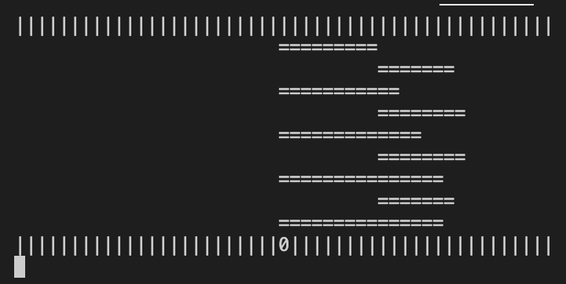

# Multithread Frog Game

## Objective
In this project, the game "frog crosses river" is implemented using multithreading technique. In the game, the player would control the movements of the frog by using the four keys "w", "s", "a" and "d". The goal for the player is to help the frog go across the river. In addition, the player may also quit the game after starting the execution by clicking the key “q”. 

## Design

The initilization of the game includes constructing the river banks and configuring the logs position and length. In detailed implementation, the parameters for the initial position of the head of logs and the length of the logs would be generated randomly. In particular, the length of the logs would be a set as random values in the range of [7, 15].

The elements of the game are stored in a 2-dimensional map. The index of an element describes
the exact position of the element. In the game, the content of the game should be updated. The way to update in this program is to clear the screen first using `system("clear")` method and then print out the content of the map. When the player hit the keys in the keyboard
to change the position of the frog, the zero element in the map would change its position
in the map by changing its index.

The implementation of the game would create 3 threads when initilization. The first
thread is designed to maintain the movements of the logs in the river with proper speed.
The second thread is used to print all the elements in the game on the screen. The third
thread is used to detect the movements of the frog and adjust the data sturcture which contains
the position information related to frog and logs. The hit of the key would be detected
by the `kbhit` function. By checking the input information, the program can receive the
operations that the player performs.

After the game is over, the correponding game status would be recorded and the resulting
information (win, lose or quit) would be printed onto the screen.

## Output Demo

The above image shows the display in the terminal after executing the program using `./a.out`. The river banks are denoted using "|" symbol and the logs of different lengths are denoted with different numbers of "=" symbol. The position "0" denotes the position of the frog.

## Developing Environment
1. Linux Version: Ubuntu 16.04.7 LTS
2. Linux Kernal Version: 5.10.5
3. GCC Version: 5.4.0

## Execution

There is a make file in the folder which is used to compile the source code. Therefore, please use the `make` command to compile the frog_game.cpp file. After compilation, an a.out objective file is generated. To execute it, please use `./a.out` command. After using the command, the game starts. To delete the objective files, please use the `make clean` command.
